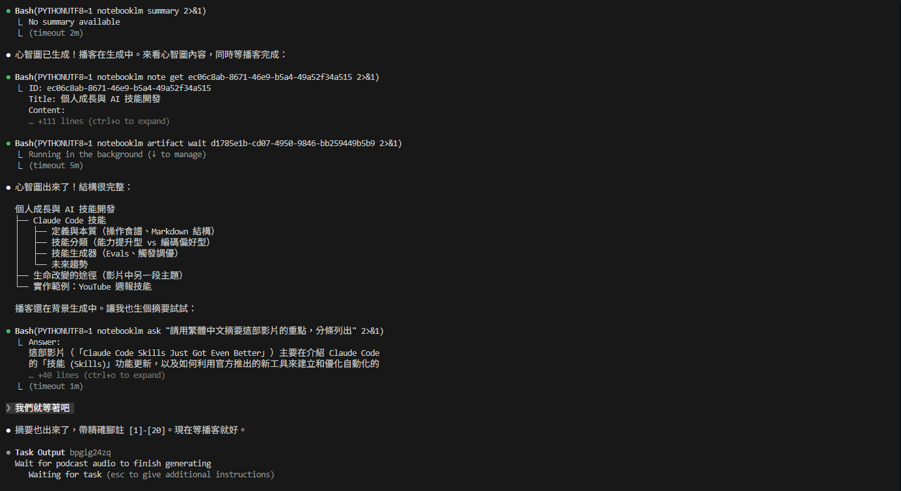

# youtube-to-notebooklm

搜 YouTube 影片、抓逐字稿、推進 NotebookLM，生成播客、思維導圖、測驗 — 全程在終端用自然語言完成。

[概覽](#概覽) • [開始使用](#開始使用) • [用法](#用法) • [背後工具](#背後工具)

[](README.md)

```
你：   「幫我找 cold pressed juice 的教學影片」
            ↓  yt-search
Agent：列出 20 部影片（標題、頻道、時長、觀看數）
            ↓  你選一部
你：   「把第 3 部上傳到 NotebookLM 生成播客」
            ↓  anything-to-notebooklm
Agent：下載 34 MB 播客到你的電腦
```



## 概覽

三個 [AI Agent Skills](https://docs.anthropic.com/en/docs/claude-code/skills) 協同工作。你用自然語言說話，Agent 自動判斷該呼叫哪個 Skill。

| Skill | 功能 | 底層工具 |
|-------|------|----------|
| **yt-search** | 搜尋 YouTube、取得影片資訊、下載字幕 | [yt-dlp](https://github.com/yt-dlp/yt-dlp) |
| **anything-to-notebooklm** | 將任何內容上傳到 NotebookLM 並生成產出 | [notebooklm-py](https://github.com/teng-lin/notebooklm-py) |
| **whisper-transcribe** | 轉錄音頻/影片、翻譯字幕、寄到信箱/雲端 | [faster-whisper](https://github.com/SYSTRAN/faster-whisper) |

```
使用者 ──自然語言──▶ AI Agent
                        │
        ┌───────────────┼───────────────┐
        ▼               ▼               ▼
   yt-search   anything-to-notebooklm  whisper-transcribe
   (yt-dlp)      (notebooklm-py)       (faster-whisper)
        │               │               │
        ▼               ▼               ▼
   搜尋結果        播客、簡報、       SRT/TXT 逐字稿
   字幕下載      思維導圖、測驗      翻譯後的字幕
```

## 開始使用

### 前置條件

- **Python 3.10+**
- **Google 帳號** — NotebookLM 免費使用
- **支援 Skills 的 AI Agent** — [Claude Code](https://docs.anthropic.com/en/docs/claude-code)、[Cursor](https://www.cursor.com/)、[Windsurf](https://windsurf.com/)，或任何讀取 `~/.claude/skills/` 的 Agent

### 安裝

**macOS / Linux / Git Bash：**

```bash
git clone https://github.com/hsuanhsu/youtube-to-notebooklm.git
cd youtube-to-notebooklm
bash install.sh
```

**Windows (PowerShell)：**

```powershell
git clone https://github.com/hsuanhsu/youtube-to-notebooklm.git
cd youtube-to-notebooklm
.\install.ps1
```

安裝腳本做三件事：

1. 安裝 pip 套件（`yt-dlp`、`notebooklm-py`、`markitdown`）
2. 複製 Skills 到你的 Agent Skills 目錄（自動偵測 Claude Code、Cursor、Windsurf）
3. 開瀏覽器登入 NotebookLM（只需一次）

> [!IMPORTANT]
> 安裝完成後，請**重啟你的 AI Agent** 以載入新的 Skills。

<details>
<summary>手動安裝</summary>

```bash
pip install yt-dlp notebooklm-py markitdown

cp -r skills/yt-search ~/.claude/skills/
cp -r skills/anything-to-notebooklm ~/.claude/skills/
cp -r skills/whisper-transcribe ~/.claude/skills/

notebooklm login
```

</details>

## 用法

安裝完直接用自然語言對 AI Agent 說話，Skills 會自動觸發。

### 搜影片

```
「搜影片 台灣水果外銷」
「幫我搜 NFC juice market 的 YouTube 影片」
```

### 抓字幕

```
「幫我抓這部影片的字幕 https://youtube.com/watch?v=...」
「下載這部影片的英文字幕」
```

### Whisper 轉錄

當 YouTube 沒有字幕或自動字幕不準時：

```
「這部影片沒有字幕，用 Whisper 轉錄」
「轉錄完翻譯成中文，寄到我信箱」
```

> [!NOTE]
> `whisper-transcribe` 需要額外安裝（建議有 GPU）。詳見 Skill 內的[安裝指南](skills/whisper-transcribe/references/setup.md)。

### 推進 NotebookLM

```
「把這個影片上傳到 NotebookLM 生成播客 https://youtube.com/watch?v=...」
「把這個網頁做成思維導圖 https://example.com/article」
「把這個 PDF 做成簡報 ~/Documents/research.pdf」
```

### 可以生成什麼

| 你說 | 得到 |
|------|------|
| 生成播客 | 音頻播客（深度對談、摘要、評論、辯論） |
| 做成 PPT | PDF 簡報或可編輯 PPTX |
| 畫思維導圖 | JSON 思維導圖 |
| 出題 | Markdown 測驗 |
| 生成報告 | Markdown 報告 |
| 做閃卡 | Markdown 閃卡 |

NotebookLM 也支援影片、資訊圖表、資料表格等產出。

### 多源合併

單一筆記本最多可以放 50 個來源。全部加完再生成：

```
「上傳這些然後做成報告：
 - https://example.com/article
 - https://youtube.com/watch?v=xyz
 - ~/Documents/research.pdf」
```

### 完整工作流範例

```
你：   「搜 YouTube 上 AI agent 的教學影片」
Agent：列出 20 部影片及其資訊
你：   「幫我抓第 3 部的字幕」
Agent：這部影片沒有字幕
你：   「那用 Whisper 轉錄」
Agent：下載音頻、轉錄 → SRT + TXT
你：   「翻譯成中文，然後上傳到 NotebookLM 生成播客」
Agent：翻譯字幕、上傳、生成播客 → MP4 音頻檔案
```

## 背後工具

| 工具 | 功能 | 費用 |
|------|------|------|
| [yt-dlp](https://github.com/yt-dlp/yt-dlp) | YouTube 搜尋、影片資訊、字幕下載 | 免費 |
| [notebooklm-py](https://github.com/teng-lin/notebooklm-py) | NotebookLM CLI 橋接 | 免費 |
| [markitdown](https://github.com/microsoft/markitdown) | PDF/DOCX/PPTX 轉 Markdown | 免費 |
| [faster-whisper](https://github.com/SYSTRAN/faster-whisper) | 高準確度語音轉文字 | 免費（本地） |

> [!TIP]
> **Windows 用戶**：中文亂碼時在指令前加 `PYTHONUTF8=1`。
> ```bash
> PYTHONUTF8=1 notebooklm create "筆記本名稱"
> ```
